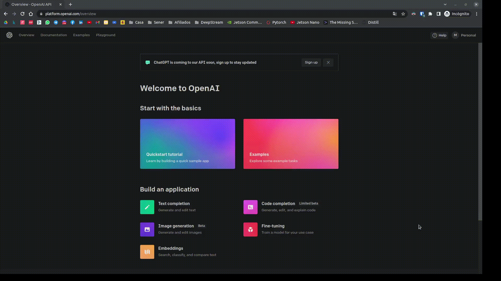
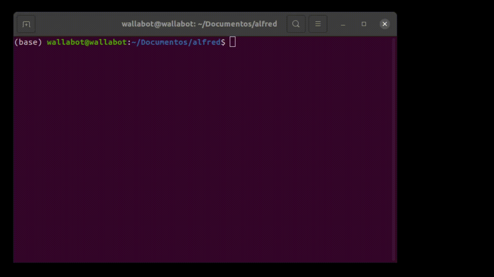

# Alfred

Personal terminal assistant for all operating systems and languages

## Install

Install requeriments

```
pip install -y halo
pip install --upgrade -y openai
```

Clone repository via `HTTPS` or `SSH`

```
git clone https://github.com/maximofn/alfred.git
```

or

```
git clone git@github.com:maximofn/alfred.git
```

Go to the alfred folder

```
cd alfred
```

## Openai API KEY

Loggin to [open ai](https://platform.openai.com/overview) and get your open ai api key



## Usage

Create a file `open_ai_api_key.py` with the text `OPENAI_API_KEY = "sk-xxxxxxxxxxxxxxxxxxxxxxxxxxxxxxxxxxxxxx"` adding your openai api or export your openai api to the `OPENAI_API_KEY` environment variable. For example

```
echo "OPENAI_API_KEY = 'sk-xxxxxxxxxxxxxxxxxxxxxxxxxxxxxxxxxxxxxx'" > open_ai_api_key.py
```

Then run `alfred.py`

```
python alfred.py
```

You just need to ask a question and **alfred** will answer it. To finish type `exit`



## Support

If you like it consider giving the repository a star ⭐, but if you really like it consider buying me a coffee ☕.

[](https://www.buymeacoffee.com/maximofn)