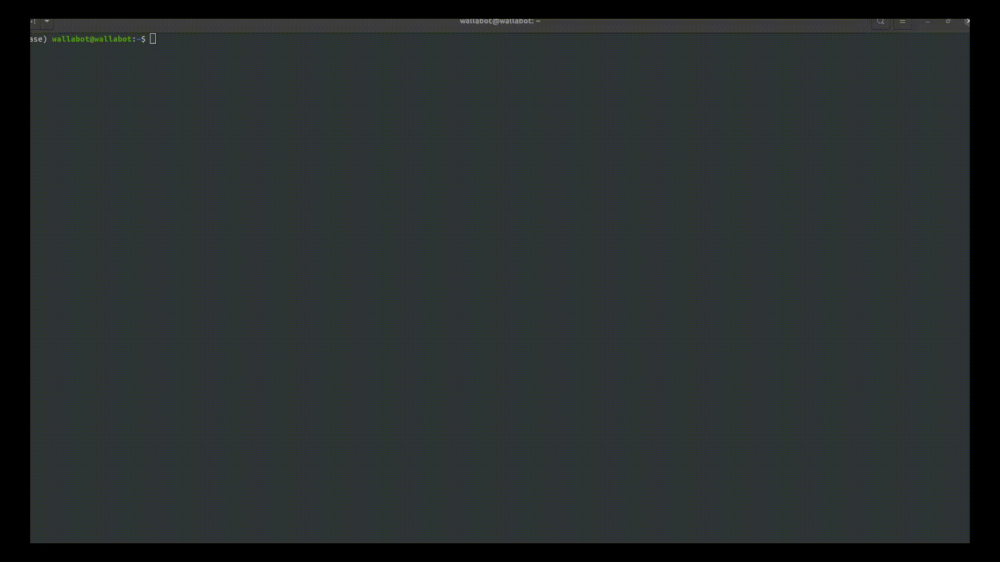
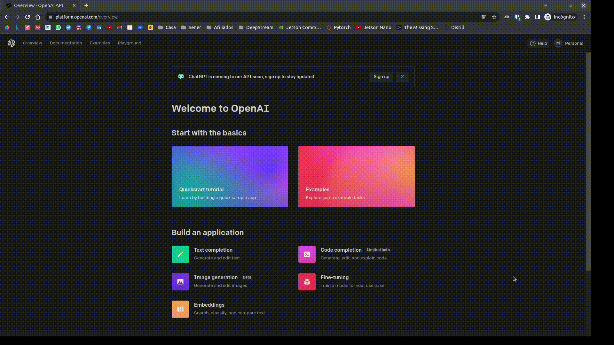
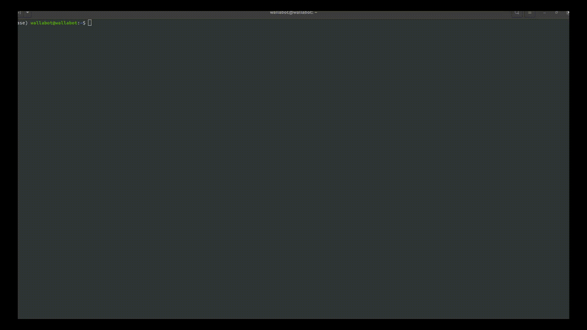

# Alfred

Personal terminal assistant for all operating systems and languages



You describe what you want in plain language, Alfred asks a model for the shell
command that does it, shows you the command, and runs it only if you say `y`.

```
👂~> find every log file bigger than 100 megabytes
<~ "find / -type f -name '*.log' -size +100M"  Execute it?(y/n)?
```

## A note on the date

Alfred was written between **19 February and 4 March 2023** — 30 commits in two
weeks. That timing is the interesting part of this repository.

ChatGPT had been public for less than three months. The `gpt-3.5-turbo` API did
not exist yet: it shipped on 1 March 2023, ten days *after* Alfred's first
commit, which is why the original version ran on the `text-davinci-003`
completions endpoint. The tools that eventually turned "AI assistant in your
terminal" into a category — Aider, Warp's AI, Codex CLI, Claude Code — were
between one and two years away.

The loop Alfred used then is the loop those tools use now: state the intent in
natural language, let the model propose a concrete action, put a human in front
of the execution, run it. Alfred is a small, early, unpolished version of that
bet, made when it was still a guess rather than a product category.

It is not a full agent. There is no tool schema, no memory across turns, no
planning, no retry on failure — one prompt, one command, one confirmation. But
the shape was right, and the git history says when.

Today it runs on `gpt-4o-mini` through the chat completions API. Everything else
works the way it did in 2023.

## Install

Alfred is a single Python script. Install it from the `main` branch — that is
the only version that still runs (see [Older versions](#older-versions) below).

### 1. System requirements

Python 3 and git. On Debian/Ubuntu:

```
sudo apt update
sudo apt install -y python3 python3-pip git
```

On macOS, with [Homebrew](https://brew.sh):

```
brew install python git
```

### 2. Python requirements

```
pip install --upgrade "openai>=1.0" halo
```

Alfred uses the modern `openai.OpenAI` client, so `openai` 1.0 or newer is
required.

### 3. Get the code

Clone Alfred into `/usr/src/alfred`. The path matters: Alfred saves your API key
next to the script, at `/usr/src/alfred/openai.key`, and that location is
hardcoded.

```
sudo git clone -b main https://github.com/maximofn/alfred.git /usr/src/alfred
sudo chmod +x /usr/src/alfred/alfred.py
```

Reinstalling over a previous copy? Remove the old one first:

```
sudo rm -rf /usr/src/alfred
```

### 4. Add the alias

Use `~/.bashrc` for bash, `~/.zshrc` for zsh:

```
echo 'alias alfred="/usr/src/alfred/alfred.py"' >> ~/.bashrc
source ~/.bashrc
```

### 5. Check it works

```
alfred "list the files in this directory"
```

Alfred will ask for your OpenAI API key the first time. It should then print a
command and wait for your confirmation.

### Update

```
sudo git -C /usr/src/alfred pull
```

Your saved API key lives in `/usr/src/alfred/openai.key`, which is not tracked
by git, so pulling will not delete it.

### Uninstall

```
sudo rm -rf /usr/src/alfred
```

Then remove the `alias alfred=...` line from your `~/.bashrc` or `~/.zshrc`.

### Older versions

The repository still has the `branch_v1.0`, `branch_v1.2` and `branch_v1.3`
branches, plus an [alfred.deb](https://github.com/maximofn/alfred/blob/v1.3/alfredv1_3.deb)
installer built from v1.3. **None of them work anymore.** They call
`text-davinci-003` through `openai.Completion.create`: OpenAI retired that model
in January 2024, and that call was removed from the `openai` package in version
1.0. They are kept as a record of the 2023 code, not as something to install.

## OpenAI API key

Log in to <a href="https://platform.openai.com/overview" target="_blank">OpenAI</a>
and get your API key.



Alfred asks for it on first run and saves it to `/usr/src/alfred/openai.key`.
That write needs `sudo`, which is why it prompts for your password.

## Usage

Ask a one-off question by typing `alfred` followed by your request:


Or run `alfred` on its own and keep asking. Type `exit` to quit:



## Before you run it

Alfred executes shell commands on your machine. It always shows you the command
and waits for a `y` before running anything, but that confirmation is the only
safeguard there is — read the command before approving it. A model can propose
something destructive, and Alfred will not stop you.

## Support

If you like it consider giving the repository a star ⭐, but if you really like
it consider buying me a coffee ☕.

[](https://www.buymeacoffee.com/maximofn)
