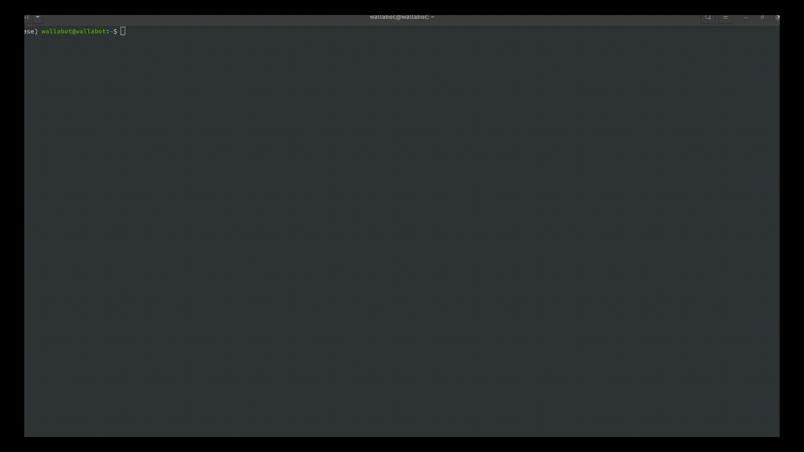

# Alfred

Personal terminal assistant for all operating systems and languages

## Install

Install system requeriments

```
sudo apt update
sudo apt install -y python3 python3-pip git
```

### Install by installer

From here, if you have a debian based system you can use the [alfred.deb](https://github.com/maximofn/alfred/blob/v1.3/alfredv1_3.deb) installer.

### Install from source

Install python requeriments

```
pip install halo
pip install --upgrade openai
```

Create source folder

```
sudo rm -r /usr/src/alfred
cd /usr/src
git clone -b branch_v1.3 https://github.com/maximofn/alfred.git
cd /usr/src/alfred
sudo find . -depth -not -name '*.py' -delete
```

Create symbolic link to /usr/bin/alfred

```
echo 'alias alfred="/usr/src/alfred/alfred.py"' >> ~/.bashrc
```

Restart bash

```
source ~/.bashrc
```

## Openai API KEY

Loggin to <a href="https://platform.openai.com/overview" target="_blank">open ai</a> and get your open ai api key


## Usage

You can ask to alfred specific questions by typing `alfred` followed by your question

Or write `alfred` and keep asking him questions. To finish type `exit`



## Support

If you like it consider giving the repository a star ⭐, but if you really like it consider buying me a coffee ☕.

[](https://www.buymeacoffee.com/maximofn)